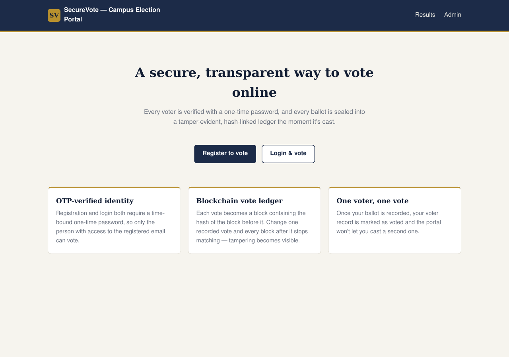
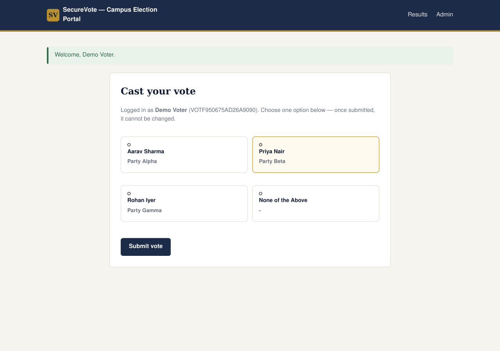
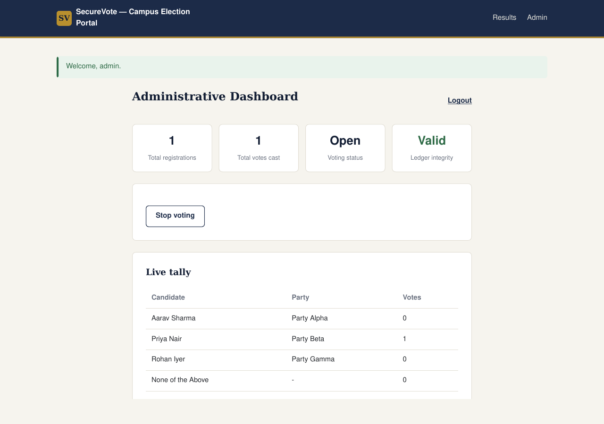
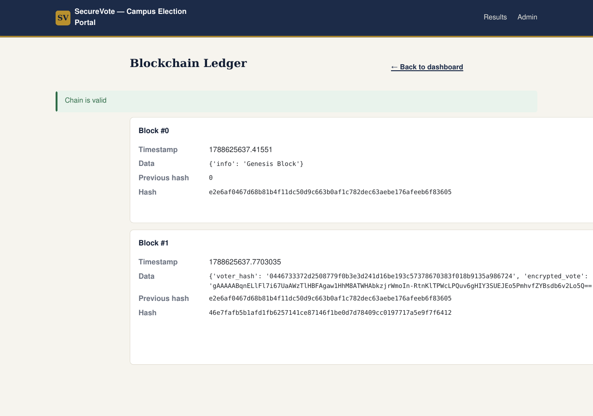

# SecureVote

SecureVote is an academic online voting prototype built with Flask. It combines
email OTP verification, one-voter-one-vote enforcement, encrypted ballots, and
a local hash-linked ledger that makes changes to recorded blocks detectable.

> **Important:** This is not a production election platform. The ledger is a
> local blockchain-style hash chain, not a decentralized blockchain network.



## Features

- OTP verification during registration and login
- Cryptographically generated voter IDs
- Hashed OTP storage with expiry, resend cooldown, and attempt limits
- OTP delivery through authenticated Gmail SMTP in production
- One recorded ballot per verified voter
- Fernet-encrypted candidate selections
- Hash-linked vote ledger with startup integrity validation
- Live result view and administrator dashboard
- Voting pause and resume control
- CSRF protection, secure production cookies, and baseline security headers
- Railway health endpoint at `/health`

## Technology stack

- Python 3.12
- Flask and Jinja2
- SQLite
- Flask-WTF and Werkzeug
- `cryptography` Fernet encryption
- Gmail SMTP with an App Password
- Gunicorn
- Docker

## Architecture

1. A voter registers with a name and email address.
2. SecureVote sends a time-bound OTP through the configured Gmail account.
3. Successful verification creates a unique voter ID.
4. Login requires the voter ID, email address, and another OTP.
5. The selected candidate ID is encrypted with Fernet.
6. A voter hash and encrypted ballot are written to a hash-linked block.
7. SQLite marks the voter as having voted.
8. The dashboard decrypts valid ballots to calculate the tally.

The current SQLite and JSON design is intentionally limited to one application
instance. The supplied Gunicorn command therefore uses one worker and one
thread.

## Local setup

```bash
python -m venv .venv
```

Activate the environment:

```bash
# Linux or macOS
source .venv/bin/activate

# Windows PowerShell
.venv\Scripts\Activate.ps1
```

Install dependencies and run the app:

```bash
pip install -r requirements.txt
python app.py
```

Open `http://127.0.0.1:5000`.

Local development allows on-screen OTPs when email delivery is absent. Never
enable this fallback on a public deployment. Production starts `app.py`
directly through Gunicorn and fails safely when SMTP is unavailable.

## Environment variables

| Variable | Required in production | Purpose |
| --- | --- | --- |
| `APP_ENV` | Recommended | Set to `production` outside Railway or for production-like local tests. |
| `FLASK_SECRET_KEY` | Yes | Stable Flask session-signing secret. |
| `ADMIN_USERNAME` | Recommended | Administrator login name. Defaults to `admin` locally. |
| `ADMIN_PASSWORD` | Yes | Strong administrator password. No production fallback is allowed. |
| `DATA_DIR` | Yes on Railway | Directory for SQLite, ledger, and generated encryption key. Use `/data`. |
| `FERNET_KEY` | Optional | Stable Fernet key. If omitted, a key is generated inside `DATA_DIR`. |
| `SESSION_COOKIE_SECURE` | Yes | Use `1` on HTTPS deployments. |
| `ALLOW_DEV_OTP` | Yes | Use `0` in production. Prevents OTPs appearing in logs or pages. |
| `SMTP_HOST` | Yes for email OTP | Use `smtp.gmail.com`. |
| `SMTP_PORT` | Yes for email OTP | Use `587` for STARTTLS. |
| `SMTP_USER` | Yes for email OTP | Dedicated Gmail address used to send OTPs. |
| `SMTP_PASS` | Yes for email OTP | 16-digit Google App Password. Never use the normal Google password. |

Copy `.env.example` only as a reference. Do not commit a real `.env` file,
Gmail address, or App Password.

Generate a Flask secret locally:

```bash
python -c "import secrets; print(secrets.token_hex(32))"
```

Generate an optional Fernet key:

```bash
python -c "from cryptography.fernet import Fernet; print(Fernet.generate_key().decode())"
```

## Deploy on Railway

The repository includes a Dockerfile, so Railway can build and start it without
a deprecated `railway.json` configuration file.

1. Push this repository to GitHub.
2. In Railway, create a project and choose **Deploy from GitHub repo**.
3. Select this repository.
4. Add a persistent volume to the web service and mount it at `/data`.
5. Add the following service variables:

```text
DATA_DIR=/data
FLASK_SECRET_KEY=<generated-random-secret>
ADMIN_USERNAME=<your-admin-name>
ADMIN_PASSWORD=<strong-unique-password>
SESSION_COOKIE_SECURE=1
ALLOW_DEV_OTP=0
SMTP_HOST=smtp.gmail.com
SMTP_PORT=587
SMTP_USER=<your-dedicated-gmail-address>
SMTP_PASS=<your-16-digit-google-app-password>
```

### Free Gmail OTP setup

1. Create or use a dedicated Gmail account for SecureVote.
2. Enable 2-Step Verification on that Google account.
3. Open Google Account > Security > App passwords.
4. Create an App Password for SecureVote.
5. In Railway Variables, set `SMTP_USER` to the Gmail address and `SMTP_PASS`
   to the 16-digit App Password. Do not put either value in GitHub.

This route does not need a Google Cloud project, Gmail API credentials, a
custom domain, or a payment card. It can send OTPs to voters using different
email addresses. It is suitable for a student demonstration and small tests,
but Gmail sending, spam filtering, and anti-abuse limits still apply.

6. Set the Railway health-check path to `/health`.
7. Keep the service at one replica because the current app uses SQLite and a
   process-local JSON ledger.
8. Generate a public domain from the service networking settings.

Railway injects the `PORT` variable. The Docker start command binds Gunicorn to
that port automatically through `app.py`.

Without a volume, `voting.db`, `chain_data.json`, and the generated Fernet key
will be lost when Railway replaces the container. Do not skip the volume step.

## Run tests

```bash
python -m unittest discover -s tests -v
```

## Repository safety

The following files are intentionally excluded from Git:

- `.env` and other real environment files
- `secret.key`
- `voting.db` and SQLite sidecar files
- `chain_data.json` and ledger backups
- Python caches, virtual environments, and logs
- Real Gmail addresses and App Passwords

The uploaded project archive originally contained real runtime data. This
repository was rebuilt from source files only. No original voter database,
ledger, backup ledger, or encryption key is included.

## Screenshots

### Ballot screen



### Administrator dashboard



### Hash-linked ledger



## Known limitations and next steps

- Replace SQLite and the JSON ledger with a transactional database design.
- Add production-grade, shared rate limiting for registration, login, and OTP
  endpoints.
- Add formal voter eligibility and identity verification.
- Hide or delay results until voting closes.
- Add external security testing, monitoring, backups, and recovery procedures.
- Move to a real distributed ledger only if independent consensus is actually
  required.

Read [SECURITY.md](SECURITY.md) before deploying or extending the project.
